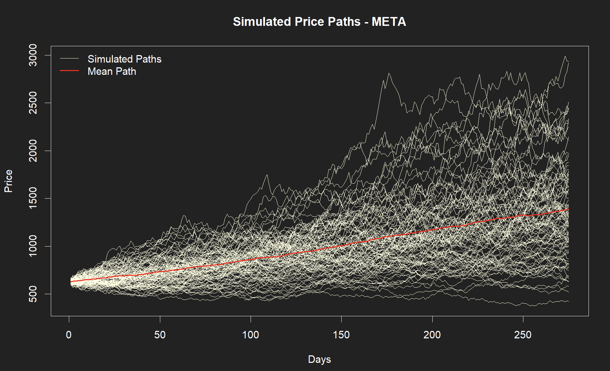
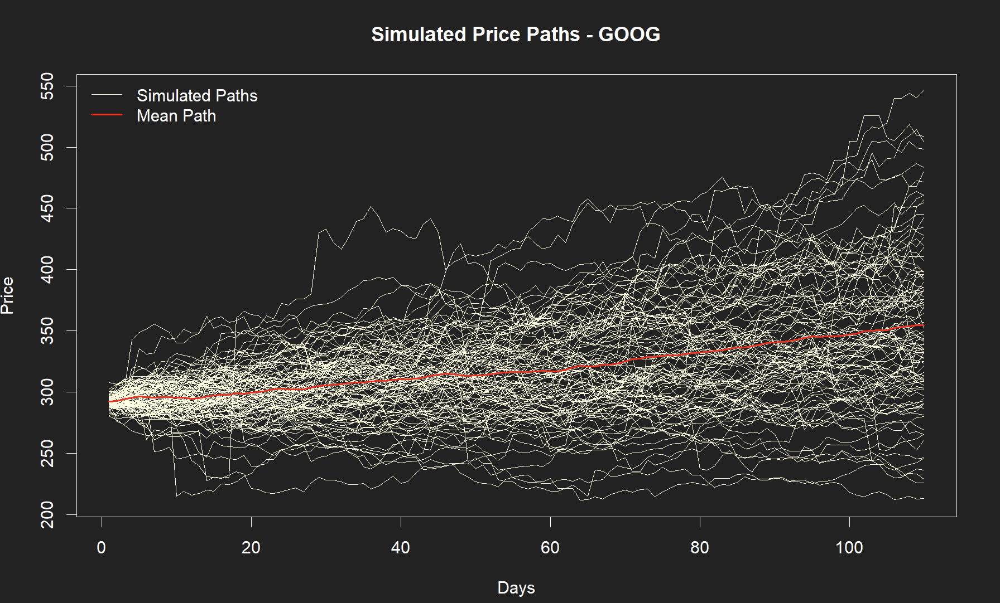
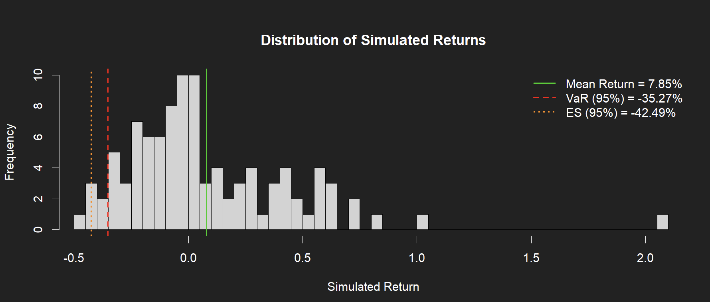
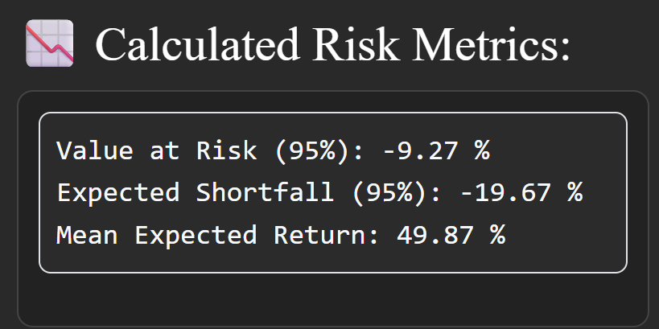

```{r setup, include=FALSE}
knitr::opts_chunk$set(echo = FALSE)
```

## Introduction

**Goal of the project:**

-   Build an interactive Shiny app that simulates stock prices using the Monte Carlo method.
-   Visualize financial risk metrics: **Value at Risk (VaR)** and **Expected Shortfall (ES)**.
-   Compare results for **U.S.** and **Polish** markets.
-   Include **Student-t distribution** for more volatile market conditions.

## Application Structure

::::: {style="display: flex; justify-content: space-between;"}
::: {style="width: 48%;"}
**Main tabs in the dashboard:**

1.  US Market Simulation\
2.  Polish Market Simulation\
3.  Student-t (Volatile) Market\
4.  Understanding VaR & ES
:::

::: {style="width: 48%;"}
**Key features:**

-   Live data downloading\
-   Customizable simulation period\
-   Dark theme UI (*Bootswatch: Darkly*)\
-   Automatic VaR & ES calculation with dynamic interpretation\
:::
:::::

## Monte Carlo Method

-   Monte Carlo simulation generates thousands of possible future price paths.
-   Each path represents a potential market scenario.
-   Based on historical returns, we simulate random future outcomes.
-   From these simulated returns, we compute **VaR** and **ES**.

**Process overview:**

Download data → Compute returns → Simulate price paths → Analyze risk metrics → Visual output

## Monte Carlo Simulation Function

```{r, eval=FALSE, echo = TRUE}
simulate_montecarlo <- function(prices, days = 252, paths = 1000) {
  if (is.null(prices) || length(prices) < 2) {
    stop("Not enough data to simulate.")
  }
  
  # Calculate log returns - choice of log returns will be explained on next slide
  returns <- diff(log(prices))
  # Metrics needed to simulate market moves based on normal distribution
  mu <- mean(returns, na.rm = TRUE)
  sigma <- sd(returns, na.rm = TRUE)
  
  # Last known price = starting point
  S0 <- tail(prices, 1)
  
  # Simulate random normal price moves
  sim <- matrix(rnorm(days * paths, mean = mu, sd = sigma), ncol = paths)
  
  # Convert to cumulative prices
  sim_prices <- S0 * exp(apply(sim, 2, cumsum))
  # We use cumulative sums of log-returns because log transforms 
  # multiplication of price factors into simple addition.
  
  return(sim_prices)
```

## Logarithmic Returns

$$
r_t = \ln\left(\frac{P_t}{P_{t-1}}\right)
$$

**Why log-returns?**\

-   They reduce the impact of large price jumps.\
-   They are **symmetric** – an increase and a decrease of the same percentage     have equal weight.\
-   **They can be easily summed over time.**\
-   They lead to smoother, more realistic simulations.

## Symmetry of Logarithmic Returns

| Price Change | Simple Return | Log Return |
|--------------|---------------|------------|
| +10%         | +0.10         | +0.0953    |
| −10%         | −0.0909       | −0.0953    |

**Interpretation:**\

$$r_{\text{down}} = -r_{\text{up}}$$  This makes statistical modeling more stable and mathematically consistent.

## Polish Data Downloading Function

```{r, eval=FALSE, echo = TRUE}

# Fetching data from stooq.pl is based on creating a proper URL
get_polish_data <- function(symbol, start_date = Sys.Date() - 365*3) {
  
  # --- Building required URL ---
  d1 <- format(as.Date(start_date), "%Y%m%d") # Changing format from 2000-01-01 to 20000101
  d2 <- format(as.Date(Sys.Date()), "%Y%m%d")
  url <- paste0("https://stooq.pl/q/d/l/?s=", symbol,
                "&d1=", d1,
                "&d2=", d2,
                "&i=d")
  
  # Data is obtained as a csv file
  dane <- read.csv(url, header = TRUE, sep = ",", dec = ".")
  dane <- na.omit(dane)
  
  return(dane)
}

```

## Example Market Simulation



## Student-t Volatile Market
\

**Simulation using Student-t distribution:**

-   Can be used to model extreme volatility.
-   Produces more realistic tail risk behaviour.
-   VaR and ES are noticeably higher than under normal distribution.
-   Results are shown on the next slides


## Example Volatile Market Simulation (df= 3)



## Influence of Degrees of Freedom (df)

  The parameter `df` controls how **heavy** the tails of the distribution       are.\

| df    | Market Type     | Interpretation                     |
|-------|-----------------|------------------------------------|
| 3–5   | Highly volatile | Crisis or strong sentiment periods |
| 10–20 | Moderate        | Typical daily market behaviour     |
| 30+   | Stable          | Near-normal market behaviour       |

## Student-t Volatile Market

\




## Interpretation of Example Results

<div style="display: flex; justify-content: space-between; align-items: center;">

<div style="width: 50%; text-align: center;">
  
</div>

<div style="width: 45%;">
  <strong>Interpretation:</strong>

  - In 5% of cases, losses exceed **9.27%**.  
  - The average loss in those worst 5% of cases is **19.67%**.  
  - The mean expected return is **49.87%**.
</div>

</div>

## Conclusions
\

<div style="text-align: justify;">

The simulation results demonstrate that market prediction is highly dependent on the historical period used for parameter estimation.
Since the model assumes that future returns follow the same statistical properties as past data, its predictive power is significantly limited.
Nevertheless, this program makes it easy to explore key risk metrics such as VaR and ES which are essential for assessing tail risk.

</div>

## Future Improvements
\

-   Portfolio simulation (multi-asset handling).\

## Used Packages
\

-   [Shiny](https://shiny.posit.co/)
-   [Quantmod](https://www.quantmod.com/)
-   [Bsblib](https://rstudio.github.io/bslib/)
-   [Revealjs](https://revealjs.com/)


## Author

**Jakub Gołąb**\
Student in Econometrics and Information Technologies – AGH University\
**GitHub:** [Agonyy24](https://github.com/Agonyy24)\
**LinkedIn:** [Jakub Gołąb](https://www.linkedin.com/in/jakub-golab)
