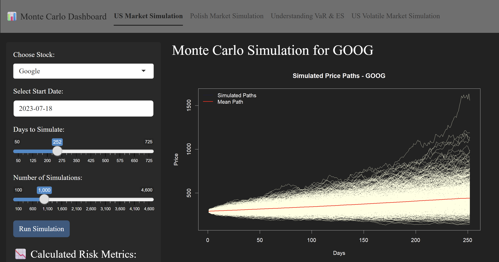
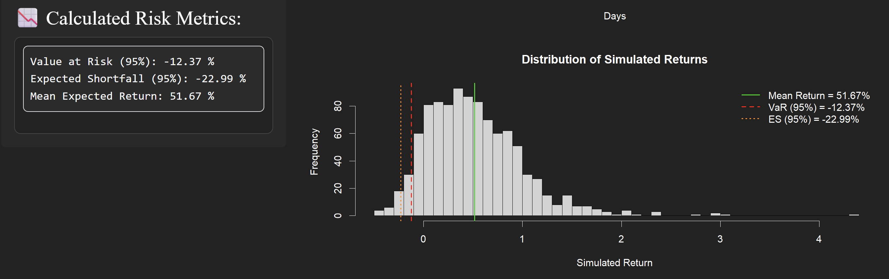

# Monte Carlo Risk Simulation Dashboard

An interactive **Shiny application** built in **R**, designed to simulate stock price movements using **Monte Carlo methods** and measure financial risk via **Value at Risk (VaR)** and **Expected Shortfall (ES)**.

## Overview

This dashboard allows users to simulate future stock prices based on historical market data, compare U.S. and Polish markets. Use both **normal** and **Student-t** distributions to analyze volatility.\
Visualize risk metrics with interactive plots and dynamic summaries. It provides a clear, educational visualization of how VaR and ES behave under different market conditions and levels of volatility.

## Features

-   **US Market Simulation** - Monte Carlo based on Yahoo Finance data  

-   **Polish Market Simulation** - Monte Carlo based on Stooq.pl data  

-   **Volatile Market (Student-t)** - heavy-tailed simulation for extreme risk scenarios

-   **Automatic VaR & ES calculation** with dynamic interpretation

-   **Automatic live data** downloading (no manual input required)

## Dashboard Preview

### U.S. Market Simulation

